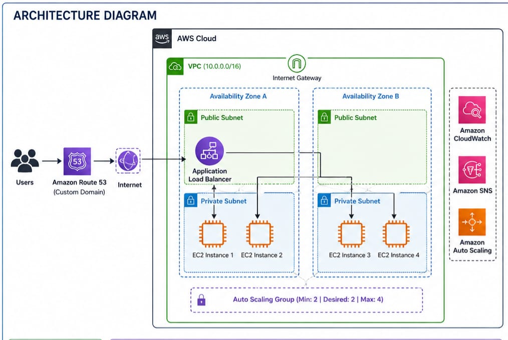
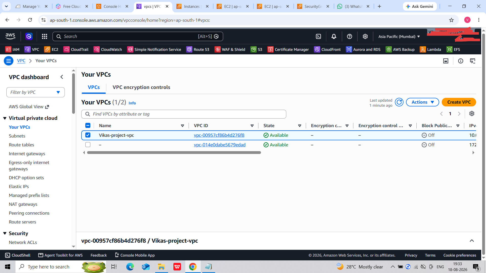

# Highly Available Web Application Deployment on AWS

## 📌 Project Overview

Designed and deployed a highly available web application on AWS using multiple EC2 instances distributed across two Availability Zones.

The application is exposed through an Application Load Balancer and uses an Auto Scaling Group to maintain availability and automatically scale resources based on workload. CloudWatch and SNS were configured for monitoring and notifications, while Route 53 and AWS Certificate Manager were used to provide a custom domain with HTTPS.

---

## 🏗️ Architecture

### Architecture Flow

Internet Users  
↓  
Amazon Route 53  
↓  
Application Load Balancer  
↓  
Auto Scaling Group  
↓  
EC2 Instances across 2 Availability Zones

CloudWatch monitors the infrastructure and sends notifications through Amazon SNS when configured conditions are triggered.

AWS Certificate Manager provides the SSL/TLS certificate used for HTTPS.

---

## ☁️ AWS Services Used

| AWS Service | Purpose |
|---|---|
| Amazon VPC | Created the networking environment |
| Amazon EC2 | Hosted the web application |
| Application Load Balancer | Distributed incoming traffic across EC2 instances |
| Auto Scaling | Maintained availability and automatically adjusted instance capacity |
| Amazon CloudWatch | Monitored resources and scaling conditions |
| Amazon SNS | Sent notifications for scaling events |
| Amazon Route 53 | Connected the custom domain to the Application Load Balancer |
| AWS Certificate Manager | Provided the SSL/TLS certificate |
| Internet Gateway | Provided internet connectivity for the VPC |

---

## ⚙️ Auto Scaling Configuration

The Auto Scaling Group was configured with:

- **Minimum capacity:** 2 instances
- **Desired capacity:** 2 instances
- **Maximum capacity:** 4 instances
- Instances distributed across **2 Availability Zones**
- Dynamic scaling policy configured based on workload

This configuration helps maintain application availability while allowing the infrastructure to scale according to demand.

---

## 🔄 Load Balancing

An **Application Load Balancer (ALB)** was configured to receive incoming HTTP/HTTPS traffic and distribute requests across healthy EC2 instances.

A Target Group was created and associated with the EC2 instances.

Health checks were configured to ensure traffic is directed only toward healthy targets.

---

## 📈 Monitoring and Auto Scaling

Amazon CloudWatch was configured to monitor the application infrastructure and scaling conditions.

Separate scale-out and scale-in conditions were configured.

When the configured conditions were reached:

- Additional EC2 instances were launched during scale-out.
- Instances were removed during scale-in when capacity was no longer required.
- Amazon SNS notifications were triggered to provide alerts.

---

## 🔔 SNS Notifications

Amazon SNS was configured to send email notifications for scaling events.

The project demonstrated notifications for:

- Scale-out events
- Scale-in events

This provided visibility into changes in the Auto Scaling Group.

---

## 🌐 Custom Domain and HTTPS

Amazon Route 53 was configured to connect the custom domain to the Application Load Balancer.

AWS Certificate Manager was used to obtain and validate an SSL/TLS certificate.

HTTPS was then configured on the Application Load Balancer, allowing users to securely access the web application.

---

## 🖥️ Application

A simple college/placement portal web application was used as the workload for the AWS deployment.

The application was hosted on the EC2 instances and accessed through the Application Load Balancer and custom domain.

---

## 📸 Project Screenshots

### VPC

### EC2 Instances

### Application Load Balancer

### Target Group

### Auto Scaling Configuration

### Dynamic Scaling Policy

### CloudWatch Scale-In Alarm

### CloudWatch Scale-Out Alarm

### SNS Topics

### SNS Scale-In Notification

### SNS Scale-Out Notification

### Route 53

### ACM Certificate

### HTTPS Website

---

## 🎯 Key Features

- High availability across two Availability Zones
- Application Load Balancer for traffic distribution
- Auto Scaling with minimum, desired, and maximum capacity
- Dynamic scaling based on workload
- EC2 health checks through Target Groups
- CloudWatch monitoring
- SNS email notifications
- Custom domain using Route 53
- SSL/TLS certificate using AWS Certificate Manager
- Secure HTTPS access

---

## 📚 Key Learnings

Through this project, I gained hands-on experience with:

- AWS VPC networking
- EC2 instance deployment
- Application Load Balancer configuration
- Target Groups and health checks
- Auto Scaling Groups
- Dynamic scaling policies
- CloudWatch monitoring and alarms
- SNS notifications
- Route 53 DNS configuration
- AWS Certificate Manager
- HTTPS configuration
- Designing highly available cloud infrastructure

---

## 🚀 Project Outcome

Successfully deployed a highly available web application on AWS with traffic distribution, automatic scaling, monitoring, notifications, custom DNS, and HTTPS security.

The project demonstrates practical understanding of AWS infrastructure, high availability, scalability, monitoring, and cloud networking.
